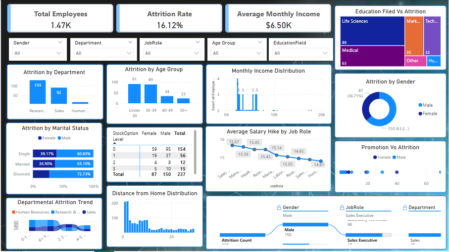

# Employee Attrition Analysis Dashboard (Power BI)

This Power BI dashboard provides deep insights into employee attrition patterns. It is built using an HR dataset and showcases how visual analytics can help organizations identify attrition drivers and improve employee retention strategies.

## 📊 Dashboard Preview

---

## 🚀 Key Visuals and Metrics

| Metric / Visual Title                              | Chart Type                 | X-Axis / Category                        | Y-Axis / Value                          |
|----------------------------------------------------|----------------------------|------------------------------------------|------------------------------------------|
| Total Employees                                    | Card                       | –                                        | Total Employees                          |
| Attrition Rate                                     | Card                       | –                                        | Attrition Rate                           |
| Average Monthly Income                             | Card                       | –                                        | Average Monthly Income                   |
| Attrition by Department                            | Clustered Column Chart     | Department                               | Attrition Count                          |
| Attrition by Age Group                             | Stacked Column Chart       | Age Group                                | Attrition Count                          |
| Monthly Income Distribution                        | Area Chart                 | MonthlyIncome (binned)                   | Employee Count                           |
| Attrition by Gender                                | Donut Chart                | Gender                                   | Attrition Count                          |
| Attrition by Marital Status                        | 100% Stacked Bar Chart     | Marital Status                           | Attrition % (by Gender)                 |
| Education Field vs Attrition                       | Treemap                    | EducationField                           | Attrition Count                          |
| Stock Option vs Attrition                          | Matrix Table               | StockOptionLevel, Gender                 | Attrition Count                          |
| Average Salary Hike by Job Role                    | Line Chart                 | JobRole                                  | Avg(PercentSalaryHike)                  |
| Promotion vs Attrition                             | Scatter Plot               | YearsSinceLastPromotion                  | Attrition Count (by Gender)             |
| Departmental Attrition Trend                       | Ribbon Chart               | YearsAtCompany (Bucketed)                | Attrition Count (by Department)         |
| Distance from Home Distribution                    | Clustered Column Chart     | DistanceFromHome (binned)                | Employee Count                           |
| Attrition Breakdown by Department, Job Role, Gender| Decomposition Tree         | Department → Job Role → Gender           | Attrition Count                          |

---

## 🧩 Features

- **Interactive Slicers**: Gender, Department, Job Role, Age Group, Education Field
- **Advanced Charts**: Ribbon chart, Decomposition Tree, Area Chart
- **Exploratory Analysis**: Drill-down capability with decomposition tree
- **Custom KPIs**: Total Employees, Attrition Rate, Avg Monthly Income
  
---

## 📌 How to Use

1. Open `Employee-Attrition-Report.pbix` in Power BI Desktop.
2. Replace the dataset under `data/` with your actual HR dataset (if needed).
3. Interact with the visualizations and explore attrition trends.

---

## 🛠 Tools Used

- Power BI
- DAX
- HR Analytics Dataset (IBM or similar)

---

## 📬 Contact

For questions or collaborations, feel free to connect!

